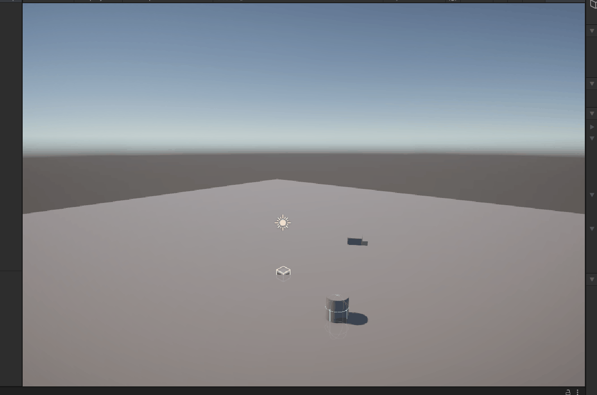
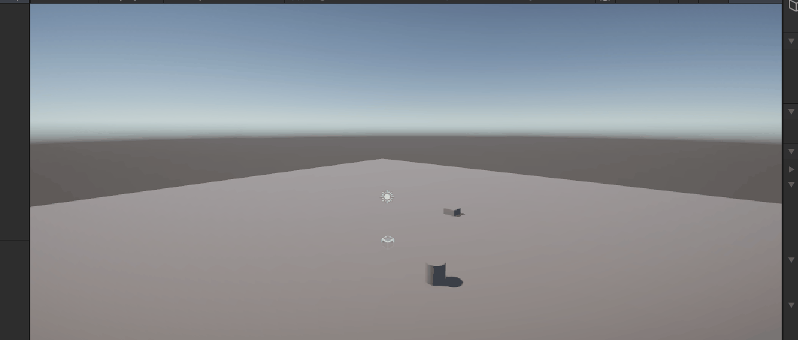

# FDV_MRU2

## Punto 1 : Encarar a un objetivo y moverse hacia el
Para realizar esto se ha creado un script llamado "LookAndForward" que primero mediante un LookAt() se encara hacia el objetivo
para luego hacer una translación.

## Punto 2: Rotacion y movimiento
Para hacer una rotación más fluida que el LookAT() se emplea en el script llamado "SlerpAndForward" el método Quaternion.Slerp()

