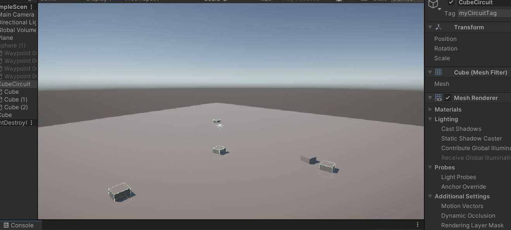

# FDV_MRU2

## Punto 1 : Encarar a un objetivo y moverse hacia el
Para realizar esto se ha creado un script llamado "LookAndForward" que primero mediante un LookAt() se encara hacia el objetivo
para luego hacer una translación.

## Punto 2: Rotacion y movimiento
Para hacer una rotación más fluida que el LookAT() se emplea en el script llamado "SlerpAndForward" el método Quaternion.Slerp()

## Punto 3: Creación de un circuito
Para hacer el circuito se ha creado un objeto que representa un circuito con varios componentes hijos etiquetados como "waypoints" el script recopila los componentes hijos, evalua sus tags y así nuestro objeto puede moverse por el circuito siguiendo los diferentes transform de los waypoints.

## Punto 4: Uso de los circuitos de Unity
